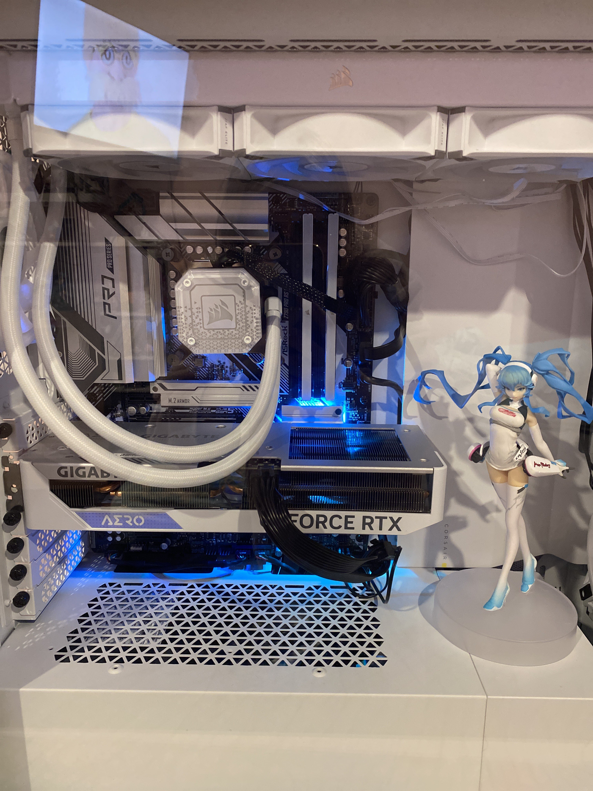

# High-Performance Builds for Gaming and Workflow

### **Project Overview**
**Client:** Freelance Contract  
**Objective:** To design and assemble a custom PC optimised for Office work and heavy multitasking within a budget of $2000.

---

## **Technical Specifications**

| Component | Part Selection | Reasoning |
| :--- | :--- | :--- |
| **CPU** | AMD Ryzen 5 7500f | Chosen for high multi-core performance in rendering tasks. |
| **GPU** | Radeon RX 7600 | Selected for 8GB VRAM and affordability. |
| **RAM** | 32GB DDR5-6000 CL30 | Optimized for high-bandwidth multitasking and stability. |
| **Storage** | 1TB NVMe Gen4 SSD | Maximises read/write speeds for large 4K video files. |
| **PSU** | 850W 80+ Gold | Ensures power efficiency and future upgrade headroom. |

---

## **Build & Configuration Log**
* **Hardware Assembly:** Executed precision cable management to optimise airflow and aesthetics within a mid-tower chassis.
* **Thermal Management:** Configured a custom fan curve; performed 2-hour stress tests using **Prime95** and **FurMark** to verify stability.
* **BIOS Tuning:** Updated BIOS to the latest revision, enabled EXPO profiles for rated RAM speeds, and configured Secure Boot.
* **OS & Drivers:** Clean installation of Windows 11 Pro, including chipset drivers and GPU optimisation.

## **Performance Benchmarks**
* **Cinebench R23:** 13,700 (Multi-Core)
* **Idle Temp / Max Load Temp:** 32°C / 64°C
* **Boot Time:** 9 seconds

---

**Client:** Freelance Contract  
**Objective:** To design and assemble a custom PC optimised for 1080/1440p gaming and heavy multitasking within a budget of $2,500.

---

## **Technical Specifications**

| Component | Part Selection | Reasoning |
| :--- | :--- | :--- |
| **CPU** | Intel i5 12400f | Chosen for high multi-core performance in rendering tasks. |
| **GPU** | NVIDIA RTX 4060 Ti | Selected for CUDA core acceleration and 8GB VRAM. |
| **RAM** | 32GB DDR5-6000 CL30 | Optimized for high-bandwidth multitasking and stability. |
| **Storage** | 2TB NVMe Gen4 SSD | Maximises read/write speeds for large 4K video files. |
| **PSU** | 850W 80+ Gold | Ensures power efficiency and future upgrade headroom. |

---

## **Build & Configuration Log**
* **Hardware Assembly:** Executed precision cable management to optimise airflow and aesthetics within a mid-tower chassis.
* **Thermal Management:** Configured a custom fan curve; performed 2-hour stress tests using **Prime95** and **FurMark** to verify stability.
* **BIOS Tuning:** Updated BIOS to the latest revision, enabled EXPO profiles for rated RAM speeds, and configured Secure Boot.
* **OS & Drivers:** Clean installation of Windows 11 Pro, including chipset drivers and GPU optimisation.

## **Performance Benchmarks**
* **Cinebench R23:** 12,300 (Multi-Core)
* **Idle Temp / Max Load Temp:** 32°C / 64°C
* **Boot Time:** 11 seconds

---

## **Gallery**
*Add your photos here by dragging them into the GitHub folder and linking them like this:*

---

**Client:** Freelance Contract  
**Objective:** To design and assemble a custom PC optimised for 1080p gaming and light multitasking within a budget of $2000.

---

## **Technical Specifications**

| Component | Part Selection | Reasoning |
| :--- | :--- | :--- |
| **CPU** | Intel i5 12400f | Chosen for high multi-core performance in rendering tasks. |
| **GPU** | NVIDIA RTX 3060 | Selected for CUDA core acceleration and 8GB VRAM. |
| **RAM** | 32GB DDR4-3200 CL30 | Optimized for high-bandwidth multitasking and stability. |
| **Storage** | 2TB NVMe Gen4 SSD | Maximises read/write speeds for large 4K video files. |
| **PSU** | 750W 80+ Gold | Ensures power efficiency and future upgrade headroom. |

---

## **Build & Configuration Log**
* **Hardware Assembly:** Executed precision cable management to optimise airflow and aesthetics within a mid-tower chassis.
* **Thermal Management:** Configured a custom fan curve; performed 2-hour stress tests using **Prime95** and **FurMark** to verify stability.
* **BIOS Tuning:** Updated BIOS to the latest revision, enabled EXPO profiles for rated RAM speeds, and configured Secure Boot.
* **OS & Drivers:** Clean installation of Windows 11 Pro, including chipset drivers and GPU optimisation.

## **Performance Benchmarks**
* **Cinebench R23:** 12,200 (Multi-Core)
* **Idle Temp / Max Load Temp:** 32°C / 64°C
* **Boot Time:** 12 seconds

---

